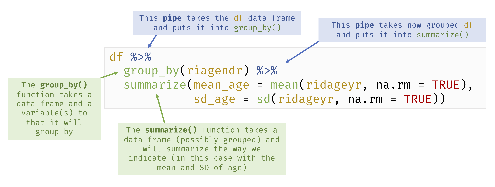
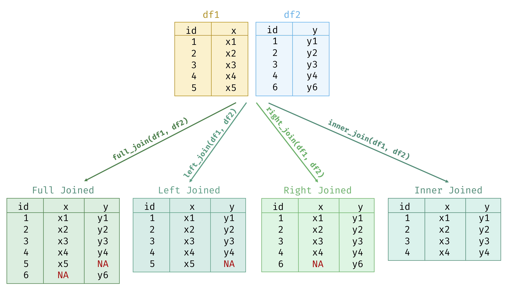

```{r, echo = FALSE}
options(width = 50)
```

<style>
body, html{
    max-width: 800px;
    margin: 0 auto !important;
    float: none !important;
}
</style>

# Chapter 2: Cleaning and Shaping Your Data {-}

> "Organizing is what you do before you do something, so that when you do it, it is not all mixed up." --- A. A. Milne

In order to gain insight from our data, we must first learn to clean and shape our data. Because we work with real data, researchers rarely have access to analysis-ready data. The fact is real-world data sets are rarely in a format that is ready for analysis. 

In this chapter, we will learn how to do clean and shape our data in the most modern and straightforward way. This approach relies on the `tidyverse`[^hadley]---a group of packages[^pack] that provide a simple syntax that can do many basic (and complex) data manipulating. Together, they form a sort of "grammar" of data manipulation that simplifies both the coding approach and the way researchers think about working with data. 

By the end of this chapter, you will be given the tools to take a messy data set (say, from Excel) and clean it up so that it can be analyzed. For this chapter, we start with more straightforward data situations and will get into the more complex aspects of data cleaning and reshaping in Chapter 8.

<!-- Chapter Goals Box -->
<div style="border:3px; border-style:solid; border-color:#F1C40F; background-color:#FEF9E7; padding: 1em;">
**Chapter Goals:** The goal of this chapter is to help you be able to take a messy data set (often how data are stored) and turn it into "tidy" data (the way they can best be analyzed). Do do so, we will:

- discuss what "tidy" data means and apply the concept to real-world data
- introduce the "pipe" operator and show how it helps in tidy methods
- identify the `tidyverse` verbs and apply them
- do general cleaning with the `janitor` package

We will also present what is actually happening to the data when we use these functions. This may be the most difficult part to learn, so be patient with yourself as you learn not only the functions in R but also learn what is happening to the data when using these functions.</div>

Before getting into the details, let's define a few common terms that you will see when learning to work with data. 

| Action               | Definition                                                                    |
|----------------------|-------------------------------------------------------------------------------|
| Cleaning             | To remove inconsistencies in the data format, sometimes can including shaping |
| Shaping              | To put the data into a rectangular shape, either in "long" or "wide" format   |
| Manipulating         | Any/all adjustments made to the data (incorporates cleaning and shaping)      |
| Wrangling            | To obtain, import, clean, and shape data (the broadest of these actions)      |

These four terms are somewhat synonymous and vaguely refer to similar actions. However, these general terms are not specific enough for us to be effective. In this chapter we will learn more specific terms that will go beyond these general actions to specifics, allowing us to communicate more clearly about our data work.


## Installing the Tidyverse and Janitor {-}

First thing we need to do is install the packages we need. The group of packages from both the `tidyverse` and `janitor` can be downloaded via:
```{r, eval=FALSE}
install.packages("tidyverse")
install.packages("janitor")
```

After downloading it, to use its functions, simply use:
```{r}
library(tidyverse)
library(janitor)
```

Note that when we loaded the tidyverse, it loaded several packages and told you of "conflicts". This generally is a concerning term. In this case, the conflicts are where two or more packages have a function with the same name. These functions with the same name will almost invariably differ in what they do. In this situation, the last loaded package is the one that `R` will use by default. For example, if we loaded two packages---`awesome` and `amazing`---and both had the function `make_really_cool()` and we loaded `awesome` and then `amazing` as so:
```{r, eval=FALSE}
library(awesome)
library(amazing)
```
`R` will automatically use the function from `amazing`. We can still access the `awesome` version of the function (because, again, even though the name is the same, they won't necessarily do the same things for you). We can do this by:

```{r, eval=FALSE}
awesome::make_really_cool(args)
```
We saw this notation in Chapter 1. To review, the `::` notation grabs the function from inside of the package and let's you use just that function. That's a bit of an aside, but know that you can always get at a function even if it is "masked" in your current session.

## Tidy Methods {-}

We are learning **tidy methods** for four main reasons:

1. Data analysis is much more straightforward when the data set is tidy. Messy data can complicate even simple analyses. Tidy data can simplify any analysis.
2. Tidy methods simplify the code and makes the code more readable. It is often worthwhile to make sure the code is readable for, as the saying goes, there are always at least two collaborators on any project: you and future you. So, let's be kind to our future selves by making our code more readable.
3. Tidy methods are the cutting edge of data work in `R`. The most influential individuals in the `R` world, including the makers and maintainers of `RStudio`, use these methods.
4. The majority of what you'll need to do with data as a researcher will be covered by these functions. 

The end goal tidy methods is to produce a tidy data set. **Tidy data** is a concept based on columns being variables and rows being observations. What this actually means depends largely on your data and research design but the definition is always the same---columns are variables and rows are observations. Generally speaking, it is the form that allows us to analyze it, whether that analysis is by graphing, modeling, or other means.

Before diving in, though, its important for you to see some examples of tidy data (also sometimes referred to as "long form") and how they are different from another form, often called "wide form." This distinction is particularly important in data with multiple measurement periods per individual (longitudinal design), or there are multiple individuals per cluster (clustered design). When the data is cross-sectional and each individual is a row, the data may already be in tidy form.

### Wide Form {-}

**Wide form** generally has one unit (i.e. individual) per row, even if there are multiple clusters or time points measured. This generally looks like:

```{r, echo=FALSE}
tibble::tibble("ID"=c(1:10), "Var_Time1"=rnorm(10), "Var_Time2"=runif(10))
```

Notice that each row has a unique ID, and some of the columns (all in this case) are variables at specific time points. This means that the variable is split up and is not a single column. This is a common way to collect and store data and so your data may look similar to this. 

### Long Form {-}

In contrast, **long format** has the lowest nested unit as a single row. This means that a single ID can span multiple rows, usually with a unique time point or cluster for each row as so:

```{r, echo=FALSE}
tibble::tibble("ID"=c(1,1,1,1,2,2,3,3,3), 
               "Time"=c(1,2,3,4,1,2,1,2,3), 
               "Var"=runif(9))
```

Notice that a single ID spans multiple columns and that each row has only one time point. Here, time is nested within individuals making it the lowest unit. Therefore, each row corresponds to a single time point. Generally, this is the format we want for most modeling techniques and most visualizations.

This is a very simple example of the differences between wide and long format. Although much more complex examples may be available to you, we will start with this for now. Chapter 8 will delve into more complex data designs and how to reshape those.

There are several methods that help create tidy data:

1. Piping
2. Selecting and Filtering
3. Mutate and Transmute
4. Grouping and Summarizing
5. Reshaping
6. Joining (merging)

<!-- Heads Up! Box -->
<p style="border:3px; border-style:solid; border-color:#B03A2E; background-color:#FDEDEC; padding: 1em;">
**Heads up!** Understanding these tools requires an understanding of what ways data can be moved around. For example, reshaping can refer to moving data into a more wide-format or a more long-format, can refer to summarizing or aggregating, and can refer to joining or binding. All of these are necessary to work with data flexibly. Because of this, we suggest taking your time to fully understand what each function is doing with the data.
</p>

Much of these may be things you have done in other tools such as spreadsheets. The copy-and-paste approach is seriously error prone and is not reproducible. Taking your time to learn these methods will be well worth it.


### Data Used for Examples {-}

To help illustrate each aspect of cleaning and shaping your data, we are going to use real data from the National Health and Nutrition Examiniation Survey (NHANES). I've provided this data at [tysonbarrett.com/assets/Data/NHANES.zip](https://tysonbarrett.com/assets/Data/NHANES.zip). I've cleaned it up somewhat already to make our examples clearer.

Let's quickly read that data in so we can use it throughout the remainder of this chapter.

```{r, echo=FALSE}
## Run but not shown
library(rio)
dem_df <- import("~/Dropbox/GitHub/blog_rstats/assets/Data/NHANES_demographics_11.xpt")
med_df <- import("~/Dropbox/GitHub/blog_rstats/assets/Data/NHANES_MedHeath_11.xpt")
men_df <- import("~/Dropbox/GitHub/blog_rstats/assets/Data/NHANES_MentHealth_11.xpt")
act_df <- import("~/Dropbox/GitHub/blog_rstats/assets/Data/NHANES_PhysActivity_11.xpt")
```

```{r, eval=FALSE}
library(rio)
dem_df <- import("NHANES_demographics_11.xpt")
med_df <- import("NHANES_MedHeath_11.xpt")
men_df <- import("NHANES_MentHealth_11.xpt")
act_df <- import("NHANES_PhysActivity_11.xpt")
```

Now we have four separate, but related, data sets in memory:

1. `dem_df` containing demographic information
2. `med_df` containing medical health information
3. `men_df` containing mental health information
4. `act_df` containing activity level information

Since all of them have all-cap variable names, we are going to quickly change this with a little trick:

```{r}
names(dem_df) <- tolower(names(dem_df))
names(med_df) <- tolower(names(med_df))
names(men_df) <- tolower(names(men_df))
names(act_df) <- tolower(names(act_df))
```
This takes the names of the data frame (on the right hand side), changes them to lower case and then reassigns them to the names of the data frame.[^names]

We will now go through each aspect of the tidy way of working with data using these four data sets.

## Piping {-}

First, the **pipe operator** -- `%>%`. Why look at this? It helps simplify the code and makes things more readable. It takes what is on the left hand side of the pipe and puts that in the right hand side's function. For example:
```{r, eval=FALSE}
dem_df %>% head()
```
This code takes the data frame `dem_df` and puts it into the `head` function. This does the exact same thing as `head(dem_df)`. 

To illustrate its strength, consider the following example. We take `dem_df`, group it by sex, and then summarize by taking the mean and SD of age.

```{r}
dem_df %>%
  group_by(riagendr) %>%
  summarize(mean_age = mean(ridageyr, na.rm = TRUE),
            sd_age = sd(ridageyr, na.rm = TRUE))
```

Without using the pipe, we would need to use something like:

```{r}
summarize(group_by(dem_df, riagendr), 
          mean_age = mean(ridageyr, na.rm = TRUE), sd_age = sd(ridageyr, na.rm = TRUE))
```

Which is more natural to read? For the majority of individuals, the first is far more intuitive than the second. Although the second is fewer lines, this is notably harder to understand. Instead of reading from left to right, top to bottom (as is natural for English reading individuals), we must read inside out. And, not only that, but finding the most inside part can be difficult. But with the first, we know where to start---the top! And move on down the pipeline.

This example is further illustrated in the figure below. 



Importantly, all of the functions we've used with the pipe so far want the data frame as the first argument so the pipe works with them naturally. We will see how to use it with functions that have other arguments first later on.

We will use the pipe throughout the book to build data manipulation and analysis pipelines. Often, we will assign the results of our pipeline to a new object name, like so:

```{r}
summarized_df <- dem_df %>%
  group_by(riagendr) %>%
  summarize(mean_age = mean(ridageyr, na.rm = TRUE),
            sd_age = sd(ridageyr, na.rm = TRUE))
```

This takes our pipeline and saves it as `summarized_df`. Our pipeline takes `dem_df`, groups by gender (`riagendr`), and then gives us the mean and sd of age by the grouping factor of gender. We can see that it was assigned by just printing out the object:

```{r}
summarized_df
```

Now that you've seen the pipe and understand what it is doing, we will use it with all of the other tidy methods.

## Select Variables and Filter Observations {-}

We often want to subset our data in some way before we do many of our analyses. We may want to do this for a number of reasons (e.g., easier cognitively to think about the data, the analyses depend on the subsetting). The code below show the two main ways to subset your data: 

1. **selecting** variables and 
2. **filtering** observations.

To select three variables (i.e. gender ["riagendr"], age ["ridageyr"], and ethnicity ["ridreth1"]) we:
```{r, eval = FALSE}
selected_dem <- dem_df %>%
  select(riagendr, ridageyr, ridreth1)
```

Now, `selected_dem` has three variables and all the observations.

We can also filter (i.e. take out observations we don't want):
```{r, eval = FALSE}
filtered_dem <- dem_df %>%
  filter(riagendr == 1)
```

Since when `riagendr == 1` the individual is male, `filtered_dem` only has male participants. We can add multiple filtering options as well:
```{r, eval = FALSE}
filtered_dem <- dem_df %>%
  filter(riagendr == 1 & ridageyr > 16)
```

We now have only males that are older than 16 years old. We used `&` to say we want **both** conditions to be met. Alternatively, we could use:
```{r, eval = FALSE}
filtered_dem <- dem_df %>%
  filter(riagendr == 1 | ridageyr > 16)
```
By using `|` we are saying we want males **or** individuals older than 16. In other words, if either are met, that observation will be kept.

Finally, we can do both selecting and filtering in one step:
```{r, eval = FALSE}
filtered_selected_dem <- dem_df %>%
  select(riagendr, ridageyr, ridreth1) %>%
  filter(riagendr == 1 & ridageyr > 16)
```
where we use two `%>%` operators to grab `dem_df`, select the three variables, and then filter the rows that we want.

## Mutate and Transmute Variables {-}

Earlier we showed how to create a new variable or clean an existing one. We used the base `R` way for these. However, a great way to add and change variables is by **mutating**. To mutate, we grab `dem_df`, and create a variable called `citizen` using the factored version of `dmdcitzn` and assign it back into `dem_df`.
```{r}
dem_df <- dem_df %>%
  mutate(citizen = factor(dmdcitzn))
```
The reason we will use this way of creating a new variable or cleaning and existing one is because it is easier to read and has far fewer redundancies than the base `R` way we saw before. So, whenever you seen mutate in the code, you immediately know a variable is being added or adjusted.

If we want to only keep the variable we create, we can use `transmute()`.
```{r}
dem_df %>%
  transmute(citizen = factor(dmdcitzn)) %>% 
  head()
```


## Grouping and Summarizing {-}

A major aspect of analysis is comparing groups. Lucky for us, this is very simple in `R`. I call it the **three-step summary**:

1. Data
2. Group by
3. Summarize

```{r}
## Three step summary:
dem_df %>%                           ## 1. Data
  group_by(citizen) %>%              ## 2. Group by
  summarize(N = n())                 ## 3. Summarize
```

The output is very informative. The first column is the grouping variable and the second is the N (number of individuals) by group. We can quickly see that there are four levels, currently, to the citizen variable. After some reading of the documentation we see that `1 = Citizen` and `2 = Not a Citizen`. A value of `7` turns out to be a placeholder value for missing. And finally we have an `<NA>` category. It's unlikely that we want those to be included in any analyses, unless we are particularly interested in the missingness on this variable. So let's do some simple cleaning to get this where we want it. To do this, we will use the `furniture` package.

```{r, eval=FALSE}
install.packages("furniture")
```

```{r, message=FALSE, warning=FALSE}
library(furniture)
dem_df <- dem_df %>%
  mutate(citizen = washer(citizen, 7),                ## Changes all 7's to NA's
         citizen = washer(citizen, 2, value = 0))     ## Changes all 2's to 0's
```

The `washer()` function takes the `citizen` variable and takes the values you give it and changes it to `NA` by default or the value you provide to the `value` argument. So here, we change 7 to `NA` and then 2 to 0.

Now, our citizen variable is cleaned, with `0` meaning not a citizen and `1` meaning citizen. Let's rerun the code from above with the three step summary:

```{r}
## Three step summary:
dem_df %>%                           ## 1. Data
  group_by(citizen) %>%              ## 2. Group by
  summarize(N = n())                 ## 3. Summarize
```

Its clear that the majority of the subjects are citizens. We can also check multiple variables at the same time, just separating them with a comma in the `summarize` function.

```{r}
## Three step summary:
dem_df %>%                           ## 1. Data
  group_by(citizen) %>%              ## 2. Group by
  summarize(N = n(),                 ## 3. Summarize
            Age = mean(ridageyr, na.rm=TRUE))                 
```

We used the `n()` function (which gives us counts) and the `mean()` function which gives us the mean. Note that if there are `NA`'s in the variable, the mean (and most other functions like it) will give the result `NA`. To have `R` ignore these, we tell the `mean` function to remove the `NA`'s when you compute it using `na.rm=TRUE`.

We can also use `furniture::table1()` to do the three-step summary. By default, `table1()` will give you the mean and SD of numeric variables and counts and percentages for factors.

```{r}
## Three step summary:
dem_df %>%                           ## 1. Data
  group_by(citizen) %>%              ## 2. Group by
  table1(Age = ridageyr,             ## 3. Summarize
         Sex = factor(riagendr))                 
```

This pattern of grouping and summarizing is something that will follow us throughout the book. It's a great way to get to know your data well and to make decisions on what to do next with your data.

## Reshaping {-}

Earlier we described the differences between wide and long (or tidy) form. Now that you have an idea of the differences, we are going to introduce how to change from one to the other. Several functions exist for just this purpose, including `gather()` from the `tidyr` package and `reshape()` in the default `stats` package. Since these can be limited in certain situations, we are going to teach two functions that can be used in nearly any reshaping situation. For now, though, we will keep in simple.

First, we will go from wide to long form using `long()` from the `furniture` package.[^furniture1] We are using the ficticious data for the example of wide format from above.
```{r, echo = FALSE}
## Create wide data set to use
df_wide <- data.frame("ID"=c(1:10), 
                      "Var_Time1"=rnorm(10), 
                      "Var_Time2"=runif(10))
```

```{r}
library(furniture)
df_long <- long(df_wide, 
                c("Var_Time1", "Var_Time2"),
                v.names = "Var")
df_long
```
We gave the `long()` function the data (`df_wide`), the time varying variables (`c("Var_Time1", "Var_Time2")`), and told it what we should name the value variable (`v.names = "Var"`). Note that the function guessed, based on its name, that the variable `ID` was the identifying variable.

This function automatically assumes each observation is a time point, thus the `time` variable. We can easily change that by adding the argument `timevar` and giving it a name (e.g., `timevar = "cluster"`).

And now we will go from long to wide using `wide()` from the same package.
```{r, echo = FALSE}
## Create long data set to use
df_long <- data.frame("ID"=c(1,1,1,1,2,2,3,3,3), 
                      "Time"=c(1,2,3,4,1,2,1,2,3), 
                      "Var"=runif(9))
```

```{r}
df_wide <- wide(df_long, 
                v.names = c("Var"),
                timevar = "Time")
df_wide
```
Here, we provided the data `df_long` and the variable name (`Var`) that had the values and (`Time`) that contained the time labels (in this case, just numbers). With a little bit of code we can move data around without any copy-pasting that is so error-prone. Again, note that the function guessed, based on its name, that the variable `ID` was the identifying variable.


## Joining (merging) {-}

The final topic in the chapter is joining data sets. This is common in many situations including large surveys (e.g., a demographics set, physical activity set, family characteristics set), health records (financial data, doctors notes, diagnosis data), and longitudinal studies (data from wave I, data from wave II).

We currently have 4 data sets that have mostly the same people in them but with different variables. One tells us about the demographics; another gives us information on mental health. We may have questions that ask whether a demographic characteristics is related to a mental health factor. This means we need to merge, or join, our data sets.[^bind]

When we merge a data set, we combine them based on some ID variable(s). Here, this is simple since each individual is given a unique identifier in the variable `seqn`. Within the `dplyr` package (part of the tidyverse) there are four main joining functions: `inner_join()`, `left_join()`, `right_join()` and `full_join()`. Each join combines the data in slightly different ways. 

Let's illustrate these using the following simple data sets called `df1` and `df2` as shown below. Note that `df1` has IDs 1 through 5 and `df2` is missing 5 but has ID 6. So they overlap with IDs 1 through 4 but not 5 or 6.

```{r, echo = FALSE}
## Data ----
df1 <- tibble::tibble(
  id = 1:5,
  x = paste0("x", 1:5)
)
df2 <- tibble::tibble(
  id = (1:6)[-5],
  y = paste0("y", (1:6)[-5])
)
```
```{r}
df1
df2
```

The diagram below shows what each type of join would produce with these two data frames.



Let's go through each one.


### Inner Join {-}

With **inner join,**, only those individuals that are in both data sets that you are combining will remain. So if person "A" is in data set 1 and not in data set 2 then he/she will not be included.

```{r, eval=FALSE}
inner_join(df1, df2, by="IDvariable")
```

### Left or Right Join {-}

This is similar to inner join but now if the individual is in data set 1 then **left join** will keep them even if they aren't in data set 2. **right join** means if they are in data set 2 then they will be kept whether or not they are in data set 1.

```{r, eval=FALSE}
left_join(df1, df2, by="IDvariable")   ## keeps all in df1
right_join(df1, df2, by="IDvariable")  ## keeps all in df2
```

### Full Join {-}

**Full join** keeps all individuals that are in either data set 1 or data set 2. 

```{r, eval=FALSE}
full_join(df1, df2, by="IDvariable")
```

Each of the left, right and full joins will have missing values placed in the variables where that individual wasn't found. For example, if person "A" was not in `df2`, then in a full join they would have missing values in the `df1` variables.

For our NHANES example, we will use `full_join()` to get all the data sets together. Note that in the code below we do all the joining in the same overall step. 

```{r}
df <- dem_df %>%
  full_join(med_df, by="seqn") %>%
  full_join(men_df, by="seqn") %>%
  full_join(act_df, by="seqn")
```

So now `df` is the joined data set of all four. We started with `dem_df` joined it with `med_df` by `seqn` then joined that joined data set with `men_df` by `seqn`, and so on.


## All Together Now {-}

Let's put all the pieces together that we've learned in the chapter together on this new `df` data frame we just created. Below, we using piping, selecting, filtering, grouping, and summarizing.

First, let's create an overall depression variable that is the sum of all the depression items (we could do IRT or some other way of combining them but that is not the point here). Below, we do three things:

1. We clean up each depression item using `furniture::washer()` since both "7" and "9" are placeholders for missing values. We take override the original variable with the cleaned one.
2. Next, we sum all the items into a new variable called `dep`.
3. Finally, we create a dichotomized variable called `dep2` using nested `ifelse()` functions. The `ifelse()` statements read: if condition holds (`dep` is greater than or equal to `10`), then `1`, else if condition holds (`dep` is less than `10`), then `0`, else `NA`. The basic build of the function is: `ifelse(condition, value if true, value if false)`.

In the end, we are creating a new data frame called `df2` with the new and improved `df` with the items cleaned and depression summed and dichotomized.
```{r}
df2 <- df %>%
  mutate(dpq010 = washer(dpq010, 7,9),
         dpq020 = washer(dpq020, 7,9),
         dpq030 = washer(dpq030, 7,9),
         dpq040 = washer(dpq040, 7,9),
         dpq050 = washer(dpq050, 7,9),
         dpq060 = washer(dpq060, 7,9),
         dpq070 = washer(dpq070, 7,9),
         dpq080 = washer(dpq080, 7,9),
         dpq090 = washer(dpq090, 7,9),
         dpq100 = washer(dpq100, 7,9)) %>%
  mutate(dep = dpq010 + dpq020 + dpq030 + dpq040 + dpq050 +
               dpq060 + dpq070 + dpq080 + dpq090) %>%
  mutate(dep2 = factor(ifelse(dep >= 10, 1,
                       ifelse(dep < 10, 0, NA))))
```

After these adjustments, let's select, filter, group by, and summarize.

```{r}
df2 %>%
  select(ridageyr, riagendr, mcq010, dep) %>%
  filter(ridageyr > 10 & ridageyr < 40) %>%
  group_by(riagendr) %>%
  summarize(asthma = mean(mcq010, na.rm=TRUE),
            depr   = mean(dep, na.rm=TRUE))
```

We can see that males (`riagendr = 1`) have nearly identical asthma levels but lower depression levels than females in this sample.

For many analyses in later chapters, we will use this new `df2` object that is the combination of all the data sets that we had before with the cleaning we just did. Whenever this is the case, this data will be explicitly referenced. Note, that in addition to what was shown in this chapter, a few other cleaning tasks were done on the data. This final version of `df2` can be found at [tysonbarrett.com/r4research](https://tysonbarrett.com/r4research/).


## Other General Cleaning Functions {-}

A package known as `janitor` provides some nice functions that add to the ideas presented in this chapter. Specifically, two functions are of note:

1. `clean_names()` -- cleans up the names of the data frame to make them easier to type and make sure it works well with `R`.
2. `remove_empty()` -- removes either empty columns or empty rows (columns or rows that have only missing values).

These can be used in tandem, like so:
```{r}
df3 <- df2 %>%
  janitor::clean_names() %>%
  janitor::remove_empty("cols") %>%
  janitor::remove_empty("rows")
```
`df3` then has variable names that are easy to work with in `R` and does not have any empty rows or columns. 


## Conclusion

With these methods, you can clean, shape, subset, and summarize your data. With the grammar provided in these methods, not only can you more easily understand your code but you will also be able to reduce your errors and more easily find the ones you make. 

These methods are foundational and will therefore come up in other chapters. A solid understanding of the functions along with what they specifically do to the data will help in nearly every phase of gaining insight from research data.

<!-- Apply it Box -->
<div style="border:3px; border-style:solid; border-color:#95A5A6; background-color:#F8F9F9; padding: 1em;">

## Apply It {-}
[This link](http://tysonbarrett.com/DataR/Chapter2.zip) contains a folder complete with an Rstudio project file, an RMarkdown file, and a few data files. Download it and unzip it to do the following steps.


### Step 1 {-}

Open the `Chapter2.Rproj` file. This will open up RStudio for you.

### Step 2 {-}

Once RStudio has started, in the panel on the lower-right, there is a `Files` tab. Click on that to see the project folder. You should see the data files and the `Chapter2.Rmd` file. Click on the `Chapter2.Rmd` file to open it. In this file, import the data, create a new variable, select three varaibles, and summarize a variable using the three step summary.

Once that code is in the file, click the `knit` button. This will create an HTML file with the code and output knitted together into one nice document. This can be read into any browser and can be used to show your work in a clean document.</div>

<div style="color:#2E4053">
## Test Yourself! {-}

1. What does the `::` do in `awesome::thing()`?
    a. Glues the `awesome` object to `thing`.
    b. Grabs the `thing()` function from the `awesome` package.
    c. Grabs the `awesome` function from the `thing()` package.
    d. Nothing of any relevance.

2. What is "tidy" data?
    a. Tidy means there are no missing data and all variables are adequately named.
    b. Tidy data is the wider formm of data.
    c. Tidy data is always more than one row per ID.
    d. Tidy data has columns that are variables and rows that are observations.

3. What does `%>%` do?
    a. Takes the thing before it and puts it into the next function.
    b. It can create a more legible syntax.
    c. Does not necessarily reduce the amount of code.
    d. All of the above.

4. Which of the following does the same thing as: `dem_df %>% str()`
    a. `str(dem_df)`
    b. `str() %>% dem_df`
    c. `str(dem_df %>%)`
    d. All of the above.
    
5. What is the difference between `select()` and `filter()`?
    a. Selecting is for variables (columns) and filtering is for rows (observations).
    b. Selecting is for rows (observations) and filtering is for variables (columns).
    c. Both actually can do the same thing.
    d. All of the above.
    
6. Which of the following would do the same thing as: `dem_df$citizen <- factor(dem_df$citizen)`?
    a. `dem_df <- mutate(dem_df, citizen = factor(citizen))`
    b. `mutate(dem_df, citizen = factor(citizen))`
    c. `dem_df$citizen <- mutate(dem_df, citizen = factor(citizen))`
    d. None of the above.

7. Which function would help us remove placeholders and replace them with `NA`?
    a. `na.omit()`
    b. `import()`
    c. `washer()`
    d. `select()`

8. In the select function, we highlighted how to select variables. What do you think `select(df, -var1)` would do?
    a. It deselects the `var1` variable.
    b. It will throw an error.
    c. The code is wrong since `select()` does not want the data frame first.
    d. None of the above.
    
9. What does the `janitor::clean_names()` function do?
    a. Removes empty columns or rows.
    b. Cleans up the names of the data frame.
    c. Reads the names of the data frame and returns them.
    d. I do not recall.
    
10. What is an R package?
    a. A group of functions can be accessed from a single location.
    b. A group of `R` chunks.
    c. Some code you can copy
    d. It depends on the situation.
</div>

[^bind]: Note that this is different than adding new rows but not new variables. Merging requires that we have at least some overlap of individuals in both data sets.

[^names]: Note that these are not particularly helpful names, but they are the names provided in the original data source. If you have questions about the data, visit [http://wwwn.cdc.gov/Nchs/Nhanes/Search/Nhanes11_12.aspx](http://wwwn.cdc.gov/Nchs/Nhanes/Search/Nhanes11_12.aspx).

[^hadley]: Hadley Wickham (2016). tidyverse: Easily Install and Load 'Tidyverse' Packages. R package version 1.0.0. https://CRAN.R-project.org/package=tidyverse

[^pack]: Remember, a package is an extension to `R` that gives you more functions that you can easily load into `R`.

[^furniture1]: Although the furniture package isn't in the `tidyverse`, it is a valuable package to use with the other `tidyverse` packages.